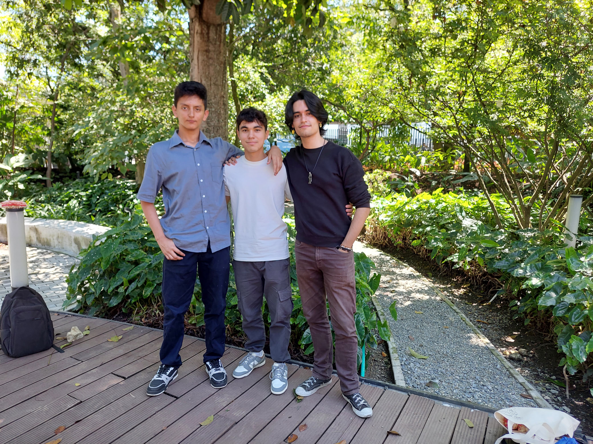

**`Winners of Inventiva 2024-1 on the "Best Performance" category!`** *Thanks to everybody, you're the real heroes :)*



We are already developing a `new version on Go`, with most of the functions `migrated into Javascript`, give it a look: [DnD-AI 2.0](https://github.com/QuitoTactico/DnD-AI-2.0)

Or check other project we developed on django (also with AI usage, better practices, automated tests and continuous deployment): [SoftServe Academy](https://github.com/QuitoTactico/SoftServe-Academy)

# Welcome to DnD-AI!

Each year, 10 million Dungeons and Dragons sessions are created, but did you know that more than half of these cannot take place due to a `lack of a Dungeon Master?` Dungeons and Dragons is a game that relies entirely on the imagination of its players, and among them, the Dungeon Master is `the one who creates the story` the players will follow, develops characters, their abilities, monsters, maps, and items – essentially, `the heart of the game`. We depend heavily on them, and there isn't always someone willing to take on the role.

What if we replaced them with an `artificial intelligence` that is available at all times? One that allows you and your friends to play a quality session whenever you want, `generating the map and enemies` automatically. That's us, DnD-AI, and we want to offer you this new way of playing – much more focused on immediate gameplay and with a faster pace.

Unlike similar ideas, we have various visual enhancements, such as `real-time map` visualization and the `generation of images` for the epic scenes that, until now, you could only imagine.

This project was deployed on GCP under the domain name of `dnd-ai.online` (Probably shutdown up to this point).

`Our page:` http://dnd-ai.online

`Our wiki:` https://github.com/QuitoTactico/DnD-AI/wiki

`Our backlog:` https://github.com/users/QuitoTactico/projects/1

# This project offers...

### Generated stories to choose
You can set the topic, or set your own story from scratch.  


### Player creation
We know you will break this game into pieces, c'mon, do it  
  
  

### Map and game generation
Including 8 different biomes with its own unique generated enemies, items, loots and portals. Every campaign is unique!  
  

  

### Interactive interface
The map is zoomable and draggable/pannable, and the player has a view range. Your party will need to explore to find all the interesting items on the map  
  
Every enemy, chest and item shows the information you need!  


### Multiplayer!!!
Praise the sun!!!  


### Three final bosses
Every campaign performs three unique generated bosses your party needs to defeat to finish the campaign!  
  
You can recognize them by the pink decoration around them  
  
But you will need to explore and find the correct route to reach them  
  
They are so damn TOUGH

### Unique optional bosses
That hopefully don't violate any copyright laws (help)  


### Image generation during campaign


### Level-up system
Yeah, stats and more stats, you will not be able to explain all of them to your grandma  


### Multiple parallel campaigns
To play one different with your friends each day  


### Plenty of completely normal weapons


### And plenty of completely stupid weapons for the bosses
Yes. You can loot them. Be happy.  


### Weapon upgrades and customization
You can also change it's name and image!  


### Parameters guide
To help you understand and use all the campaign generator has to offer. Remember that you can just write everything in natural language, the system will understand :)  


### No-AI game options
Don't worry if you don't love these soul-less machines, we have plenty of pre-created bosses, stories and weapons for you  
  
As long as you can handle the bullying...

### Copyright and moral violations everywhere
We will have to sell our houses to pay this  


### I told you about the completely normal optional bosses?


### Awesome fights


### This game fucking sucks
And it's what makes it absolutely awesome!  


### And everything you expect from a cursed and brainrotted game of dnd with your friends!
What are you waiting for? :)

# Running instructions

## To clone and run *(do the pip install if it's your first time running the project):*

```
git clone https://github.com/QuitoTactico/DnD-AI
cd DnD-AI
pip install -r "requirements.txt"
python manage.py runserver
```

Or ```sudo python3 manage.py runserver 0.0.0.0:80``` if you want your own public instance.

Docker image coming soon. Stay tuned!

## Software requirements

- The needed dependencies and libraries defined in requirements.txt. To get them, run ```pip install -r "requirements.txt"```

## AI usage requirements

- For image generation is needed either a `OpenAI API key` or a `HuggingFace API key`.  
- For action interpretation, storytelling and campaign's info providing, a `Google Gemini API key` is needed. OpenAI GPT option will be re-added in the future.

You can provide this keys either creating a file called `api_keys.env` on the root dir of the project.

```
# api_keys.env
# on root dir of the project

openai_api_key = 
hf_api_key = 
gemini_api_key = 
```

Or a file called `API.py` on `/DnD_AI/` (the application, not the project). At the same level of `functions_AI.py`, the file that uses the api keys.
```
# API.py
# on same folder as /DnD_AI/functions_AI.py

openai_api_key = " "
hf_api_key = " "
gemini_api_key = " "
```

In any case, `the game is still playable with some (or none) of the API keys`. While AI generated images being replaced with placeholder images and action inputs not being interpreted, but supporting the use of commands instead.

## What's should to be seen:


https://github.com/QuitoTactico/DnD-AI/assets/99926526/f426ac7c-4650-45de-a765-424f47cc1a3c

# External resources credits

### Icon Credits

This game uses icons from [Game-icons.net](https://game-icons.net/), licensed under the **Creative Commons Attribution 3.0 Unported (CC BY 3.0)** license. No modifications were made to the original icons. You can view the full license here: [https://creativecommons.org/licenses/by/3.0/](https://creativecommons.org/licenses/by/3.0/).

### Tiles Textures Credits

Several grid textures (tiles) such as grass, dirt, and sand were sourced from [OpenGameArt.org](https://opengameart.org/). Some of these textures were created by [Lamoot](https://opengameart.org/users/lamoot). The original authors of other textures are unknown. No modifications were made to any of the textures, and all rights to these assets belong to their respective creators.

They are great, we wouldn't have been able to create this game without them.


### El Joven (entity) Credits

Jonathan, basically. An unlucky friend, used as a test entity for the game.  
  
All intellectual property rights over him are held exclusively by his mother. She has full and perpetual ownership over his creation.

He's a cool developer too btw. https://github.com/jonathanbees  
Some say that his soul still resides in the game to this day as a playable character, but also as a boss...  

# Videos

### [DnD-AI Demostration](https://www.youtube.com/watch?v=wstDAuMiXww&t)
[](https://www.youtube.com/watch?v=wstDAuMiXww&t)

### [DnD-AI: Salcedios](https://www.youtube.com/watch?v=GX2EiZJsDOU)
[](https://www.youtube.com/watch?v=GX2EiZJsDOU)

### Don't click [here](https://www.youtube.com/watch?v=dQw4w9WgXcQ)


# Created by:
> - [Esteban Vergara Giraldo (QuitoTactico)](https://github.com/QuitoTactico)
> - [Miguel Angel Cock Cano (MACockC)](https://github.com/MiguelCock)
> - [Sebastian Salazar Osorio (Chiki)](https://github.com/Sebasalazaro)
>
> For the EAFIT course: Integrator project 1

